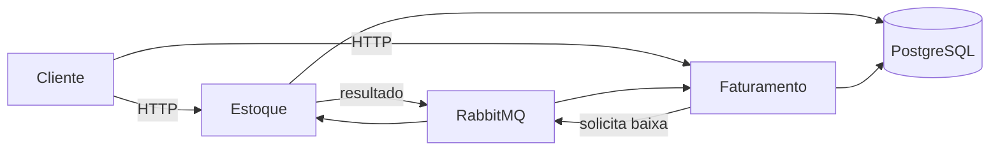

# Sistema de Emissão de Notas Fiscais

Monorepo de estudo com dois microsserviços Go para cadastro de produtos,
controle de estoque e emissão assíncrona de notas fiscais.

## Visão geral

O sistema separa dois contextos de negócio:

- **Estoque:** produtos, saldo, movimentações e baixa concorrente;
- **Faturamento:** notas fiscais, itens, totalizadores e fechamento.

As APIs usam Go, Gin, GORM e PostgreSQL. O fechamento de uma nota é processado
de forma assíncrona pelo RabbitMQ, com Transactional Outbox, idempotência,
retentativas limitadas e DLQ.



## Estado do projeto

| Componente | Estado |
|---|---|
| Estoque Service | Implementado |
| Faturamento Service | Implementado |
| Fluxo assíncrono | Implementado |
| Testes unitários, integrados e E2E | Implementados |
| Docker para infraestrutura e migrations | Implementado |
| Frontend Angular | Implementado |

## Início rápido

Pré-requisito: Docker Desktop com Docker Compose.

Crie o arquivo de ambiente.

PowerShell:

```powershell
Copy-Item .env.example .env
```

Bash, Zsh ou Git Bash:

```bash
cp .env.example .env
```

Prompt de Comando:

```bat
copy .env.example .env
```

Suba PostgreSQL, RabbitMQ e aplique as migrations a partir da raiz:

```console
docker compose config
docker compose up -d postgres rabbitmq
docker compose build estoque-migrations
docker compose run --rm estoque-migrations up
docker compose build faturamento-migrations
docker compose run --rm faturamento-migrations up
docker compose ps -a
```

As APIs Go e o Angular não rodam em containers. Em três terminais separados:

```console
cd services/estoque
go run ./cmd/api
```

```console
cd services/faturamento
go run ./cmd/api
```

```console
cd frontend/web
npm install
npm start
```

## Endereços locais

| Recurso | Endereço |
|---|---|
| Frontend | <http://localhost:4200> |
| Estoque | <http://localhost:8081> |
| Swagger do Estoque | <http://localhost:8081/swagger/index.html> |
| Faturamento | <http://localhost:8082> |
| Swagger do Faturamento | <http://localhost:8082/swagger/index.html> |
| RabbitMQ Management | <http://localhost:15672> |

Credenciais e portas de desenvolvimento estão declaradas no `.env.example`.

Com a infraestrutura e as aplicações locais ativas, execute os testes de ponta a ponta:

```console
cd tests/e2e
go test -count=1 -v ./...
```

## Estrutura

```text
.
├── docs/                   documentação técnica
├── frontend/web/           aplicação Angular
├── infrastructure/         inicialização do PostgreSQL
├── services/
│   ├── estoque/            módulo Go do Estoque
│   └── faturamento/        módulo Go do Faturamento
├── tests/e2e/              testes externos do fluxo completo
├── .env.example            contrato de configuração
└── docker-compose.yml      infraestrutura e migrations
```

## Documentação

O índice completo está em [docs/README.md](docs/README.md).

- [Arquitetura da solução](docs/README_ARQUITETURA.md)
- [Decisões arquiteturais](docs/README_DECISOES_ARQUITETURAIS.md)
- [Modelo de domínio](docs/README_MODELO_DOMINIO.md)
- [Serviço de Estoque](docs/SERVICO_ESTOQUE.md)
- [Serviço de Faturamento](docs/SERVICO_FATURAMENTO.md)
- [Mensageria e resiliência](docs/RESILIENCIA.md)
- [Execução e Docker](docs/EXECUCAO_DOCKER.md)
- [Testes](docs/TESTES.md)
- [Frontend Angular](frontend/web/README.md)

## Comandos mais usados

```console
docker compose up -d postgres rabbitmq
docker compose run --rm estoque-migrations up
docker compose run --rm faturamento-migrations up
docker compose ps -a
docker compose logs postgres rabbitmq
docker compose down
```

Os comandos locais, migrations, exemplos HTTP e procedimentos de diagnóstico
ficam nos documentos específicos para evitar duplicação neste README.

Para executar o frontend:

```console
cd frontend/web
npm install
npm start
```
