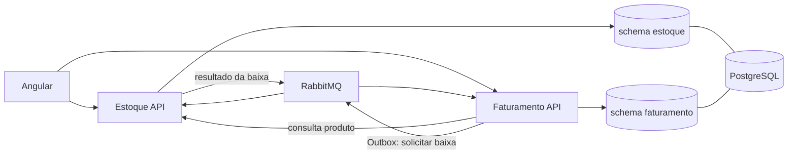
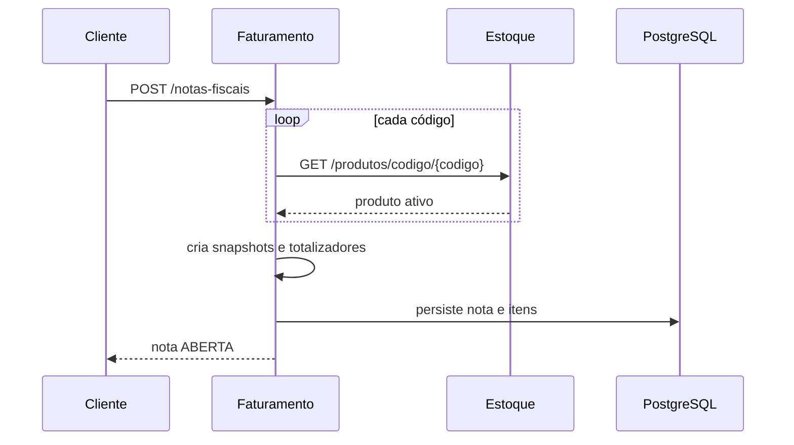
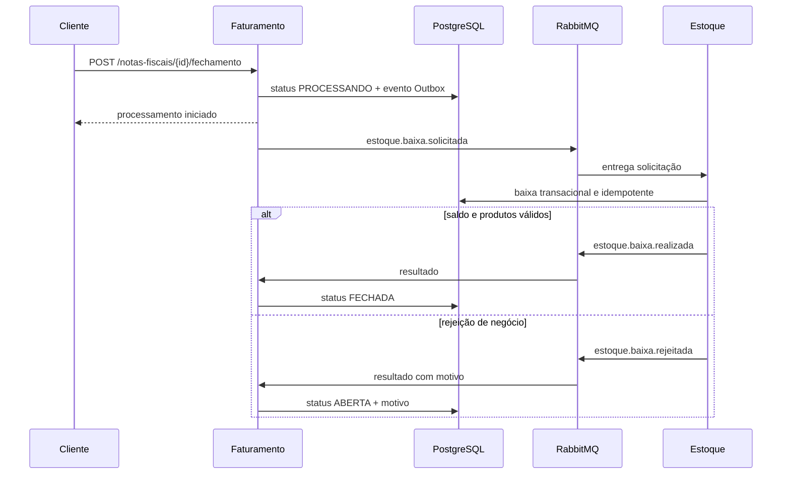

# Arquitetura da solução

## Objetivo

O sistema demonstra separação de contextos, consistência transacional e
integração assíncrona em uma solução pequena o suficiente para execução local.
Este documento descreve a arquitetura implementada. Regras detalhadas ficam no
[modelo de domínio](README_MODELO_DOMINIO.md) e justificativas nas
[decisões arquiteturais](README_DECISOES_ARQUITETURAIS.md).

## Componentes



### Estoque

É proprietário de produto, saldo, valor, estado ativo/inativo, movimentações e
baixa. Expõe consultas HTTP e consome solicitações de baixa.

### Faturamento

É proprietário de notas, itens, clientes, totalizadores, numeração e status.
Consulta o Estoque por HTTP ao montar uma nota e usa eventos no fechamento.

### PostgreSQL

Uma instância física simplifica o ambiente, mas a propriedade é separada:

```text
korp_db
├── estoque
│   ├── produtos
│   ├── movimentacoes_estoque
│   └── mensagens_processadas
└── faturamento
    ├── notas_fiscais
    ├── itens_nota_fiscal
    ├── outbox_events
    └── mensagens_processadas
```

Nenhum serviço consulta tabelas do outro schema. A separação lógica permite
migrar futuramente para bancos físicos distintos sem mudar os contratos.

### RabbitMQ

Desacopla o fechamento da disponibilidade simultânea dos dois serviços. As
mensagens e a política de falhas estão em [RESILIENCIA.md](RESILIENCIA.md).

## Formas de comunicação

### HTTP síncrono

Usado quando o chamador precisa de resposta imediata:

- operações cadastrais;
- consultas;
- validação e snapshot do produto durante criação/edição da nota;
- solicitação inicial de fechamento.

### RabbitMQ assíncrono

Usado na operação que atravessa contextos e pode demorar:

- solicitação da baixa;
- resultado de baixa realizada;
- resultado de baixa rejeitada.

Essa divisão evita mensageria em operações simples e evita acoplamento temporal
no fluxo crítico de estoque.

## Fluxo de criação da nota



O Faturamento guarda ID, código, descrição e valor do produto. A validação é
síncrona porque o cliente precisa saber imediatamente se a nota foi criada.

## Fluxo de fechamento



## Arquitetura interna dos módulos Go

Os dois módulos seguem a mesma divisão:

```text
presentation -> application -> domain
                       ^
                       |
               infrastructure
```

### Domain

Entidades, objetos de valor, regras, erros e interfaces de repositório. Não
importa Gin, GORM ou RabbitMQ.

### Application

Um use case por operação, todos com método `Execute`. Orquestra entidades e
interfaces, mas não conhece detalhes HTTP ou models de persistência.

### Infrastructure

Implementa PostgreSQL/GORM, RabbitMQ, configuração e cliente HTTP do outro
serviço. Models GORM são separados e possuem conversão explícita para domínio.

### Presentation

Handlers Gin, DTOs, Swagger, parsing de paginação, envelopes e tradução de erros
de domínio para status HTTP.

### Dependency

O pacote `internal/dependency` é o composition root: instancia implementações e
injeta repositórios, use cases, handlers e workers.

## Frontend Angular

O frontend fica em `frontend/web` e usa Angular standalone com rotas lazy por
feature. `core` concentra configuração e estado global; `shared` contém UI
reutilizável; `features` isola Produtos, Notas Fiscais e a página inicial.

Estado de tela é representado por stores RxJS com `BehaviorSubject` privado e
seletores públicos como `Observable`. Componentes consomem estado com `AsyncPipe`.
Angular Material fornece componentes visuais, acessibilidade e tema consistente.

Produtos e Notas Fiscais estão integrados às APIs por clientes HTTP e stores
RxJS. O frontend acompanha o fechamento assíncrono sem bloquear a interface.

## Consistência

Não existe uma transação distribuída entre os serviços. A solução combina:

- transações locais do PostgreSQL;
- Transactional Outbox no Faturamento;
- atualização atômica de saldo no Estoque;
- confirmação manual no RabbitMQ;
- entrega pelo menos uma vez;
- idempotência nos dois consumidores;
- consistência eventual da nota.

Após solicitar fechamento, o cliente observa `PROCESSANDO`. O estado final chega
posteriormente como `FECHADA` ou `ABERTA` com motivo.

## Implantação local

O Docker Compose contém PostgreSQL, RabbitMQ e migrations. As APIs Go e o
frontend Angular rodam no host para reduzir consumo de recursos no Docker
Desktop. As imagens de migration são multi-stage, executadas sem root e compilam
somente o comando necessário. Consulte
[EXECUCAO_DOCKER.md](EXECUCAO_DOCKER.md).

## Limites atuais

- uma instância física de PostgreSQL;
- uma instância de cada worker de Outbox;
- sem autenticação ou autorização;
- sem observabilidade distribuída;
- valores monetários usam ponto flutuante conforme decisão do projeto.

Esses limites são escolhas de escopo, não dependências acidentais entre os
contextos.
