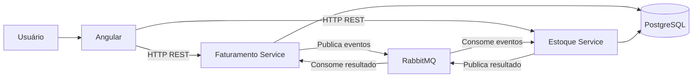
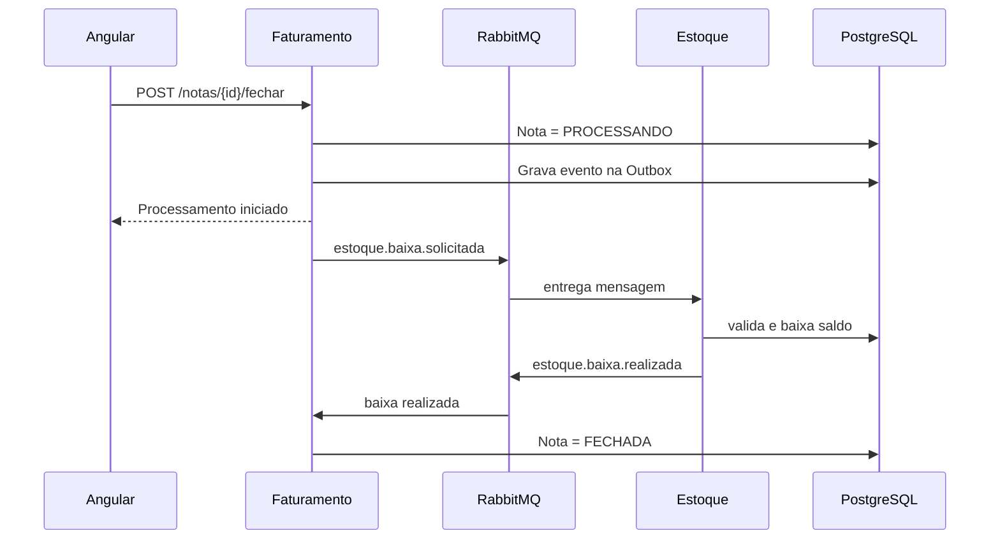
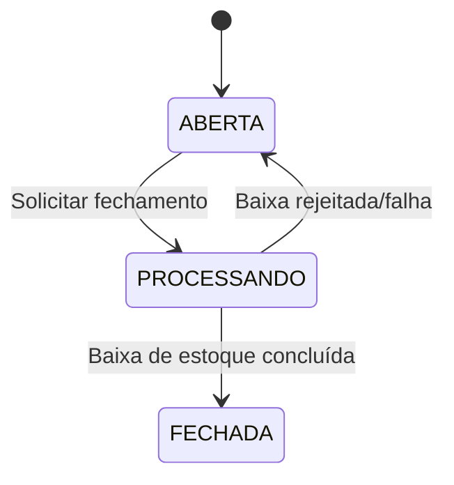
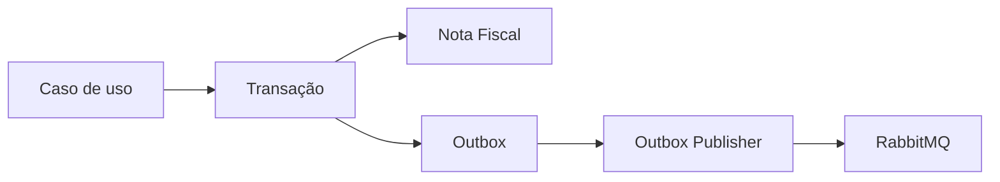
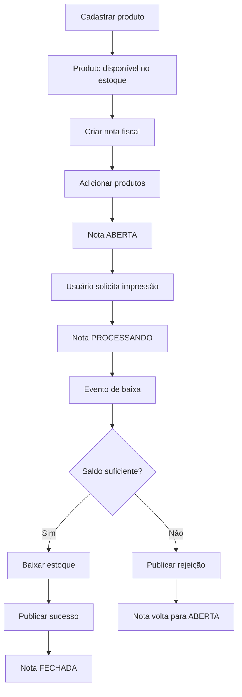

# Arquitetura do Sistema de Emissão de Notas Fiscais

## 1. Visão geral

Este documento descreve a arquitetura proposta para o desafio técnico **Sistema de Emissão de Notas Fiscais**.

A solução foi estruturada para atender aos requisitos obrigatórios do desafio:

- Frontend em Angular;
- No mínimo dois microsserviços;
- Serviço de Estoque;
- Serviço de Faturamento;
- Persistência em banco de dados real;
- Tratamento de falhas entre microsserviços;
- Atualização de saldo dos produtos ao fechar uma nota fiscal;
- Feedback de processamento e erro ao usuário.

Além dos requisitos obrigatórios, a arquitetura foi preparada para permitir a implementação dos requisitos opcionais de:

- Concorrência;
- Idempotência.

A solução proposta utiliza:

- **Angular** no frontend;
- **Go** no backend;
- **PostgreSQL** como banco de dados;
- **RabbitMQ** para comunicação assíncrona entre os microsserviços;
- **Docker Compose** para infraestrutura local.

---

## 2. Objetivos arquiteturais

A arquitetura foi desenhada com os seguintes objetivos:

1. Separar as responsabilidades de estoque e faturamento.
2. Manter baixo acoplamento entre microsserviços.
3. Evitar que um serviço manipule diretamente os dados pertencentes ao outro.
4. Permitir recuperação diante de falhas temporárias.
5. Garantir que mensagens repetidas não causem baixa duplicada de estoque.
6. Evitar saldo negativo em cenários concorrentes.
7. Facilitar execução local do projeto.
8. Manter a solução simples o suficiente para um desafio técnico, sem adicionar infraestrutura desnecessária.

---

## 3. Arquitetura de alto nível



O Angular se comunica diretamente via HTTP com os serviços responsáveis por cada funcionalidade.

A integração crítica entre faturamento e estoque ocorre através do RabbitMQ.

---

## 4. Componentes

### 4.1 Frontend

Responsável pela interação com o usuário.

Principais telas previstas:

- Cadastro de produtos;
- Listagem de produtos;
- Cadastro de nota fiscal;
- Inclusão de múltiplos produtos na nota;
- Listagem de notas;
- Visualização da nota;
- Fechamento/impressão da nota.

Responsabilidades adicionais:

- Exibir loading durante processamento;
- Bloquear impressão quando a nota não estiver aberta;
- Exibir feedback de sucesso;
- Exibir mensagens de erro;
- Atualizar a interface após o fechamento da nota.

Tecnologias sugeridas:

- Angular;
- Angular Material;
- Reactive Forms;
- HttpClient;
- RxJS.

---

## 5. Microsserviço de Estoque

O `estoque-service` é responsável exclusivamente pelo contexto de estoque.

### Responsabilidades

- Cadastrar produtos;
- Consultar produtos;
- Consultar saldo;
- Ativar e inativar produtos sem exclusão física;
- Realizar baixa de estoque;
- Validar saldo disponível;
- Controlar concorrência;
- Registrar mensagens já processadas para garantir idempotência;
- Publicar resultado da baixa de estoque.

### Dados sob responsabilidade do serviço

Exemplo:

```text
estoque.produtos
estoque.movimentacoes_estoque
estoque.mensagens_processadas
```

O serviço de Faturamento não deve realizar consultas ou alterações diretamente nessas tabelas.

---

## 6. Microsserviço de Faturamento

O `faturamento-service` é responsável pelo contexto de notas fiscais.

### Responsabilidades

- Criar notas fiscais;
- Validar no Estoque produtos informados pelo código e aceitar somente produtos ativos;
- Armazenar snapshot de descrição e valor unitário nos itens;
- Calcular quantidade total e valor total da nota;
- Manter numeração sequencial;
- Adicionar produtos e quantidades;
- Consultar notas;
- Iniciar fechamento;
- Controlar o estado da nota;
- Solicitar baixa de estoque;
- Processar o retorno do Estoque;
- Marcar a nota como fechada quando a baixa for concluída;
- Retornar a nota ao estado apropriado em caso de erro.

### Dados sob responsabilidade do serviço

Exemplo:

```text
faturamento.notas_fiscais
faturamento.itens_nota_fiscal
faturamento.outbox_events
```

---

## 7. PostgreSQL compartilhado

A solução utiliza uma única instância física do PostgreSQL.

Entretanto, os dados são separados logicamente por schema.

```text
korp_db
|
+-- estoque
|   +-- produtos
|   +-- movimentacoes_estoque
|   +-- mensagens_processadas
|
+-- faturamento
    +-- notas_fiscais
    +-- itens_nota_fiscal
    +-- outbox_events
```

### Regra importante

Compartilhar a mesma instância física de banco não significa compartilhar propriedade dos dados.

O Estoque é dono do schema `estoque`.

O Faturamento é dono do schema `faturamento`.

Portanto, deve-se evitar:

```sql
SELECT *
FROM estoque.produtos;
```

executado pelo Faturamento.

A integração entre contextos ocorre pela API ou por eventos.

---

## 8. Comunicação entre microsserviços

A comunicação entre Faturamento e Estoque será assíncrona através do RabbitMQ.

### Exemplo de fluxo



---

## 9. Eventos

### 9.1 Solicitação de baixa

Routing key:

```text
estoque.baixa.solicitada
```

Exemplo:

```json
{
  "eventId": "9fc26ec6-4ad6-4df1-9409-3ec0132aa157",
  "type": "estoque.baixa.solicitada",
  "notaFiscalId": "2ae24eed-124b-4278-a2af-b238f3812ae7",
  "itens": [
    {
      "produtoId": "f02f2c63-2dd1-4242-9464-b6cd79cc5f32",
      "quantidade": 2
    }
  ],
  "occurredAt": "2026-08-20T00:00:00Z"
}
```

### 9.2 Baixa concluída

```text
estoque.baixa.realizada
```

### 9.3 Baixa rejeitada

```text
estoque.baixa.rejeitada
```

Exemplo:

```json
{
  "eventId": "32f1d943-e06e-4a44-b91f-07ce69fa35de",
  "type": "estoque.baixa.rejeitada",
  "notaFiscalId": "2ae24eed-124b-4278-a2af-b238f3812ae7",
  "motivo": "ESTOQUE_INSUFICIENTE"
}
```

---

## 10. Estado da nota fiscal

O requisito funcional define os estados principais:

- Aberta;
- Fechada.

Para suportar processamento assíncrono, a implementação pode utilizar internamente:

```text
ABERTA
PROCESSANDO
FECHADA
```

Fluxo:



O estado `PROCESSANDO` representa uma condição transitória e permite ao frontend exibir corretamente o indicador de processamento.

---

## 11. Tratamento de falhas

O desafio exige um cenário de falha entre microsserviços.

Exemplo escolhido:

1. O usuário solicita o fechamento da nota;
2. O Faturamento publica a solicitação;
3. O serviço de Estoque está indisponível;
4. A mensagem permanece na fila;
5. Quando o Estoque retorna, a mensagem é processada;
6. A nota é fechada normalmente após o processamento.

Isso demonstra uma vantagem importante da mensageria: o serviço chamador não depende de disponibilidade simultânea do consumidor.

---

## 12. Transactional Outbox

Existe um problema clássico ao salvar dados e publicar mensagens separadamente.

Exemplo incorreto:

```text
1. Atualiza nota para PROCESSANDO
2. Commit no PostgreSQL
3. Publica RabbitMQ
4. Aplicação cai antes da publicação
```

A nota ficaria presa em `PROCESSANDO`.

Para evitar isso, a solução utiliza o padrão **Transactional Outbox**.

### Mesma transação

```text
BEGIN

UPDATE nota_fiscal
SET status = 'PROCESSANDO';

INSERT INTO faturamento.outbox_events (...);

COMMIT;
```

Posteriormente um worker publica os eventos pendentes.



---

## 13. Idempotência

O RabbitMQ pode entregar uma mensagem novamente.

Portanto, a baixa precisa ser idempotente.

Uma tabela pode registrar os eventos processados:

```sql
CREATE TABLE estoque.mensagens_processadas (
    event_id UUID PRIMARY KEY,
    processed_at TIMESTAMP NOT NULL
);
```

Fluxo:

```text
Recebe evento
   |
   +-- event_id já existe?
   |      |
   |      +-- Sim -> ignora
   |
   +-- Não
          |
          +-- baixa estoque
          +-- registra event_id
          +-- commit
```

Assim uma mensagem duplicada não baixa o estoque duas vezes.

---

## 14. Concorrência

O requisito opcional descreve o caso de saldo 1 utilizado por duas notas simultaneamente.

A baixa pode ser feita de maneira atômica:

```sql
UPDATE estoque.produtos
SET saldo = saldo - $1
WHERE id = $2
  AND saldo >= $1;
```

Depois:

```text
RowsAffected = 1 -> sucesso
RowsAffected = 0 -> saldo insuficiente
```

Essa abordagem impede saldo negativo mesmo quando dois consumidores tentam realizar a baixa simultaneamente.

---

## 15. Estrutura sugerida do repositório

```text
Korp_Teste_CaioHenrique/
|
+-- frontend/
|   +-- web/
|
+-- services/
|   |
|   +-- estoque/
|   |   +-- cmd/
|   |   |   +-- api/
|   |   |   +-- migrate/
|   |   +-- docs/
|   |   +-- internal/
|   |   |   +-- domain/
|   |   |   +-- application/
|   |   |   +-- infrastructure/
|   |   |   +-- presentation/
|   |   +-- migrations/
|   |   +-- go.mod
|   |
|   +-- faturamento/
|       +-- cmd/
|       +-- internal/
|       |   +-- domain/
|       |   +-- application/
|       |   +-- infrastructure/
|       |   +-- presentation/
|       +-- migrations/
|       +-- go.mod
|
+-- infrastructure/
|   +-- postgres/
|   +-- rabbitmq/
|
+-- docs/
|   +-- README_ARQUITETURA.md
|   +-- README_DECISOES_ARQUITETURAIS.md
|   +-- README_MODELO_DOMINIO.md
|
+-- docker-compose.yml
+-- Makefile
+-- .gitignore
+-- README.md
```

---

## 16. Estrutura interna dos serviços Go

Exemplo:

```text
internal/
|
+-- dependency/
|   +-- container.go
|
+-- domain/
|   +-- produto/
|
+-- application/
|   +-- criar_produto.go
|   +-- consultar_produto.go
|   +-- listar_produtos.go
|   +-- baixar_estoque.go
|
+-- infrastructure/
|   +-- database/
|   |   +-- models/
|   +-- repository/
|   +-- messaging/
|       +-- rabbitmq/
|
+-- presentation/
|   +-- http/
|       +-- domainerror/
|       +-- dto/
|       +-- response/
|       +-- handlers
|
+-- shared/
    +-- text/
```

Princípios:

- domínio independente de framework;
- application orquestra casos de uso;
- infrastructure implementa banco, mensageria e integrações;
- presentation expõe HTTP.

Convenções adicionais:

- construtores de entidades seguem `NewNomeDaEntidade`;
- textos de domínio são normalizados por funções compartilhadas antes da persistência;
- models GORM são separados dos repositories e convertem explicitamente com `ToDomain`;
- DTOs HTTP são separados dos handlers e não são reutilizados como entidades de domínio.
- repositories recebem nomes de negócio, sem prefixos como `Gorm`;
- a montagem das dependências concretas fica centralizada em `internal/dependency`.
- respostas HTTP usam envelopes consistentes de sucesso ou erro;
- a tradução de erros de domínio para HTTP ocorre em um pacote dedicado;
- erros inesperados não expõem detalhes internos ao cliente.
- entidades mantêm propriedades privadas e disponibilizam somente getters;
- alterações de estado usam métodos de negócio específicos, nunca setters genéricos;
- a reconstituição de models também passa pelas invariantes do domínio.
- cada operação da camada application possui um use case próprio com método `Execute`;
- não são utilizados services genéricos para agrupar casos de uso diferentes.
- produtos são preservados para rastreabilidade e usam estado ativo/inativo em vez de exclusão.
- a atualização cadastral de Produto permite somente descrição e saldo; o mesmo caso de uso orquestra `AtualizarDescricao` e `AtualizarSaldo`, mantendo suas validações no domínio.
- alterações manuais de saldo e baixas geram movimentações auditáveis;
- a baixa de múltiplos itens e o registro do `eventId` ocorrem na mesma transação;
- atualizações atômicas impedem saldo negativo sob concorrência.

---

## 17. Docker Compose

A infraestrutura final poderá conter:

```text
frontend
estoque-service
faturamento-service
postgres
rabbitmq
```

Durante o desenvolvimento, também é possível subir apenas:

```text
postgres
rabbitmq
```

e executar os serviços localmente.

---

## 18. Fluxo funcional completo



---

## 19. Tecnologias

### Frontend

- Angular
- Angular Material
- RxJS
- Reactive Forms

### Backend

- Go
- Gin
- GORM para persistência e transações
- golang-migrate para evolução versionada do schema
- Swagger/OpenAPI para documentação HTTP
- RabbitMQ client

### Infraestrutura

- PostgreSQL
- RabbitMQ
- Docker
- Docker Compose

---

## 20. Evoluções futuras

Possíveis melhorias:

- autenticação e autorização;
- API Gateway;
- observabilidade distribuída;
- tracing;
- métricas;
- dead-letter queue;
- retries com backoff;
- múltiplas instâncias dos serviços;
- banco físico separado por microsserviço;
- geração real de PDF da nota;
- integração fiscal externa.

---

## 21. Conclusão

A solução busca equilibrar simplicidade e boas práticas de sistemas distribuídos.

Mesmo utilizando uma única instância PostgreSQL, os serviços permanecem separados logicamente e cada contexto mantém propriedade exclusiva sobre seus dados.

A comunicação assíncrona via RabbitMQ, combinada com Outbox, idempotência e controle de concorrência, permite demonstrar de forma prática os principais desafios envolvidos na comunicação entre microsserviços.
