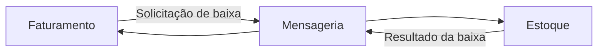
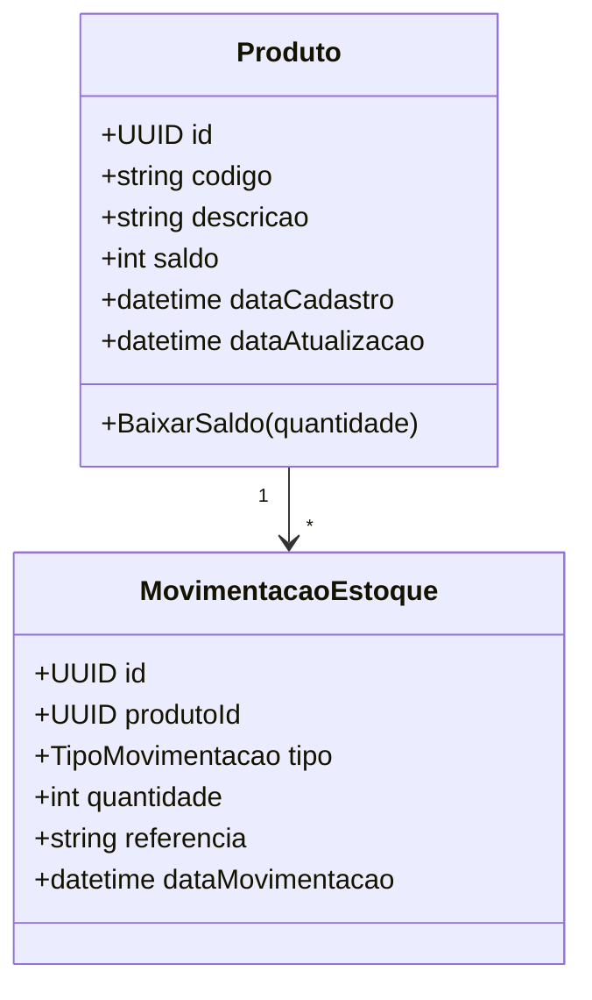
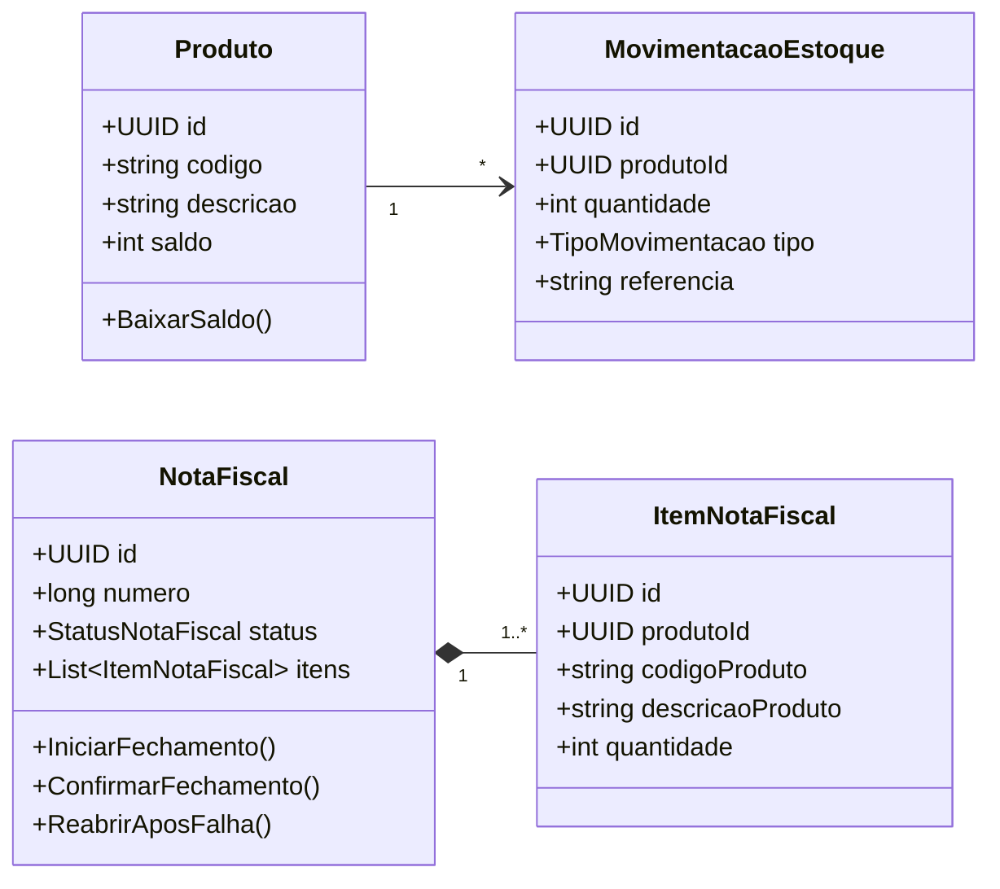
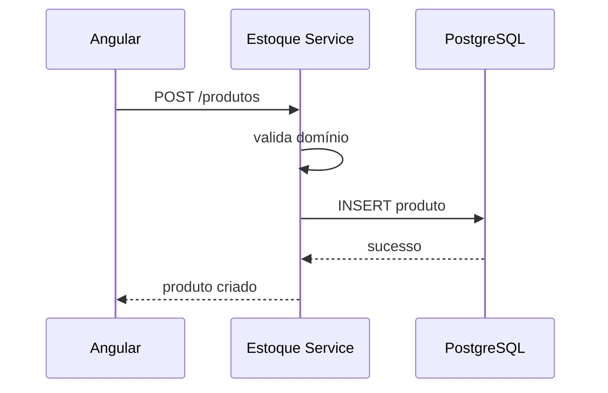
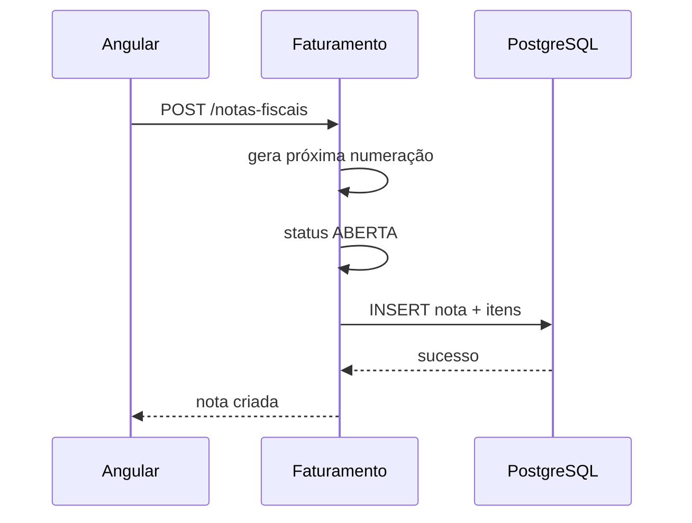
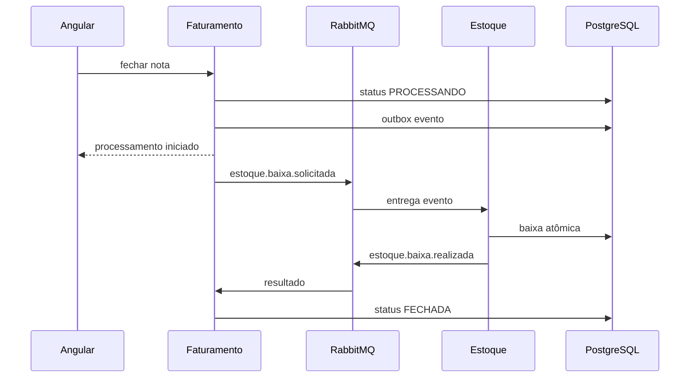
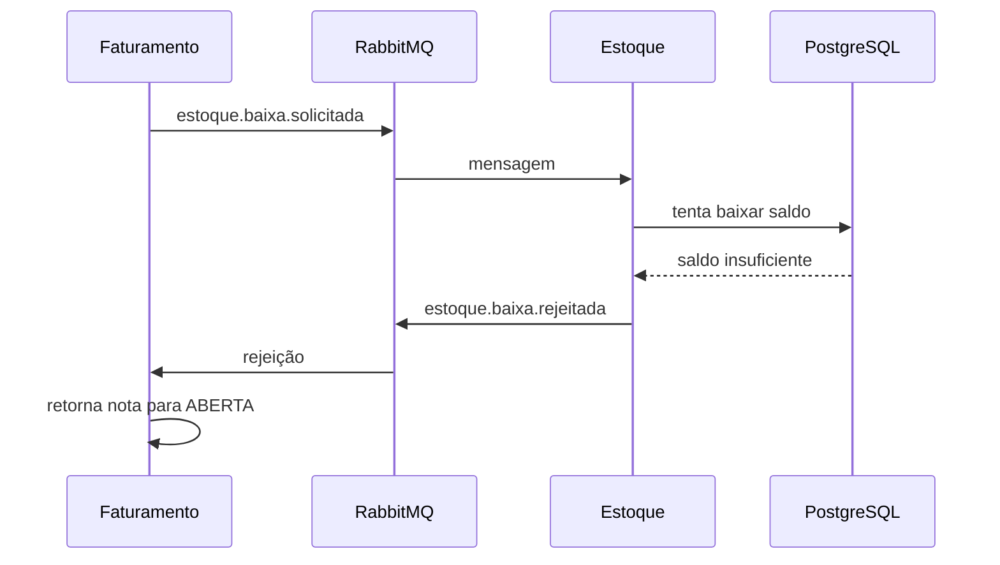

# Modelo de Domínio

## 1. Objetivo

Este documento descreve o modelo de domínio inicial do sistema de emissão de notas fiscais.

O modelo foi derivado diretamente dos requisitos do desafio e complementado apenas com estruturas técnicas necessárias para suportar:

- microsserviços;
- processamento assíncrono;
- falhas;
- concorrência;
- idempotência.

Os dois contextos principais são:

```text
Estoque
Faturamento
```

---

# 2. Bounded Contexts

## 2.1 Estoque

Responsável por:

- Produto;
- Saldo;
- Baixa de estoque;
- Movimentação;
- Concorrência;
- Idempotência de processamento.

## 2.2 Faturamento

Responsável por:

- Nota Fiscal;
- Numeração;
- Itens;
- Estado da nota;
- Processo de fechamento.



---

# 3. Contexto de Estoque

## 3.1 Aggregate Root Produto

Produto é a principal raiz de agregado do contexto de Estoque.

Campos:

```text
Produto
|
+-- id
+-- codigo
+-- descricao
+-- saldo
+-- dataCadastro
+-- dataAtualizacao
```

### Regras

1. Código é obrigatório.
2. Código deve ser único.
3. Descrição é obrigatória.
4. Saldo é obrigatório.
5. Saldo não pode ser negativo.
6. Uma baixa não pode resultar em saldo negativo.

---

## 3.2 Modelo conceitual



---

# 4. Produto

Exemplo conceitual em Go:

```go
type Produto struct {
    id              uuid.UUID
    codigo          string
    descricao       string
    saldo           int
    dataCadastro    time.Time
    dataAtualizacao time.Time
}
```

A regra de saldo deve permanecer dentro do domínio ou do caso de uso responsável pela baixa.

Exemplo:

```go
func (p *Produto) BaixarSaldo(quantidade int) error {
    if quantidade <= 0 {
        return ErrQuantidadeInvalida
    }

    if p.saldo < quantidade {
        return ErrEstoqueInsuficiente
    }

    p.saldo -= quantidade
    return nil
}
```

Mesmo utilizando um `UPDATE` atômico no repositório para concorrência, a regra de negócio continua sendo:

```text
saldo final >= 0
```

---

# 5. Movimentação de estoque

Movimentação é recomendada para rastreabilidade.

Campos:

```text
MovimentacaoEstoque
|
+-- id
+-- produtoId
+-- tipo
+-- quantidade
+-- referencia
+-- dataMovimentacao
```

Possível enum:

```text
ENTRADA
SAIDA
```

Para o desafio, a principal movimentação será:

```text
SAIDA
```

originada pelo fechamento de uma nota fiscal.

A referência pode ser o ID da Nota Fiscal.

---

# 6. Idempotência no Estoque

A idempotência não precisa fazer parte da entidade Produto.

Ela é uma responsabilidade da camada de aplicação/infraestrutura que processa mensagens.

Modelo técnico:

```text
MensagemProcessada
|
+-- eventId
+-- processedAt
```

Objetivo:

```text
evento repetido
    |
    +-- já processado?
          |
          +-- sim -> nenhum novo efeito
```

---

# 7. Contexto de Faturamento

## 7.1 Aggregate Root Nota Fiscal

A Nota Fiscal é a raiz de agregado principal.

Campos:

```text
NotaFiscal
|
+-- id
+-- numero
+-- status
+-- itens
+-- dataCadastro
+-- dataAtualizacao
+-- dataFechamento
```

---

# 8. Status da Nota Fiscal

Estados funcionais exigidos pelo desafio:

```text
ABERTA
FECHADA
```

Estado técnico recomendado:

```text
PROCESSANDO
```

Enum:

```go
type StatusNotaFiscal string

const (
    StatusAberta      StatusNotaFiscal = "ABERTA"
    StatusProcessando StatusNotaFiscal = "PROCESSANDO"
    StatusFechada     StatusNotaFiscal = "FECHADA"
)
```

---

# 9. Regras da Nota Fiscal

## Criação

Toda nota nova deve:

```text
receber numeração sequencial
iniciar como ABERTA
```

## Inclusão de itens

Uma nota pode possuir múltiplos produtos.

Cada item deve conter:

```text
produto
quantidade
```

A quantidade deve ser maior que zero.

## Impressão/fechamento

Uma nota só pode iniciar fechamento quando:

```text
status == ABERTA
```

Após iniciar:

```text
ABERTA -> PROCESSANDO
```

Depois da confirmação do Estoque:

```text
PROCESSANDO -> FECHADA
```

Em caso de rejeição:

```text
PROCESSANDO -> ABERTA
```

---

# 10. Item da Nota Fiscal

Modelo:

```text
ItemNotaFiscal
|
+-- id
+-- produtoId
+-- codigoProduto
+-- descricaoProduto
+-- quantidade
```

O `produtoId` referencia logicamente o produto pertencente ao contexto de Estoque.

Não existe foreign key obrigatória entre os schemas.

Isso é intencional.

---

# 11. Por que armazenar código e descrição no item?

Mesmo que esses dados pertençam ao Produto, é útil manter um snapshot no item.

Exemplo:

```text
Hoje:
Produto 123 = "Mouse Gamer"

Nota 100 foi fechada.

Amanhã:
Produto 123 = "Mouse Gamer RGB"
```

A nota antiga deveria continuar representando:

```text
Mouse Gamer
```

em vez de mudar historicamente junto com o cadastro do Produto.

Essa decisão pode ser aplicada durante a criação ou fechamento da nota.

---

# 12. Diagrama do domínio



---

# 13. Relacionamento entre contextos

É importante diferenciar relacionamento de domínio e relacionamento de banco.

A Nota Fiscal contém:

```text
produtoId
```

mas o Faturamento não possui uma entidade Produto própria.

```text
Faturamento                        Estoque

NotaFiscal                         Produto
   |
   +-- ItemNotaFiscal
          |
          +-- produtoId ----------> identificação lógica
```

A validação real do saldo acontece no Estoque.

---

# 14. Fluxo de criação de produto



---

# 15. Fluxo de criação de nota



---

# 16. Fluxo de fechamento



---

# 17. Fluxo com estoque insuficiente



---

# 18. Casos de uso — Estoque

## CriarProduto

Entrada:

```text
codigo
descricao
saldo
```

Saída:

```text
produto criado
```

Regras:

- código obrigatório;
- descrição obrigatória;
- saldo não negativo.

---

## ConsultarProduto

Permite consultar:

- por ID;
- por código.

---

## ListarProdutos

Permite alimentar:

- tela de produtos;
- seleção de produtos na nota.

---

## BaixarEstoque

Entrada:

```text
notaFiscalId
eventId
itens[]
```

Responsabilidades:

1. verificar idempotência;
2. validar itens;
3. garantir saldo;
4. atualizar saldo;
5. registrar movimentações;
6. registrar eventId processado;
7. publicar resultado.

---

# 19. Casos de uso — Faturamento

## CriarNotaFiscal

Responsabilidades:

1. gerar número sequencial;
2. criar nota ABERTA;
3. adicionar itens;
4. persistir.

---

## ConsultarNotaFiscal

Retorna:

- número;
- status;
- itens;
- datas.

---

## ListarNotasFiscais

Utilizado na tela principal.

---

## IniciarFechamentoNotaFiscal

Responsabilidades:

1. buscar nota;
2. validar status ABERTA;
3. alterar para PROCESSANDO;
4. criar evento Outbox;
5. persistir tudo na mesma transação.

---

## ConfirmarBaixaEstoque

Consumidor do evento:

```text
estoque.baixa.realizada
```

Responsabilidades:

1. buscar nota;
2. validar PROCESSANDO;
3. alterar para FECHADA;
4. registrar data de fechamento.

---

## RejeitarBaixaEstoque

Consumidor do evento:

```text
estoque.baixa.rejeitada
```

Responsabilidades:

1. buscar nota;
2. validar PROCESSANDO;
3. retornar para ABERTA;
4. armazenar motivo, caso desejado.

---

# 20. Numeração sequencial

A numeração deve ser sequencial.

Opções possíveis no PostgreSQL:

```text
SEQUENCE
IDENTITY
tabela de controle
```

A opção mais simples é utilizar uma sequence dedicada:

```sql
CREATE SEQUENCE faturamento.nota_fiscal_numero_seq;
```

Durante a criação:

```sql
SELECT nextval('faturamento.nota_fiscal_numero_seq');
```

Isso evita problemas com:

```sql
SELECT MAX(numero) + 1
```

em cenários concorrentes.

---

# 21. Modelo relacional inicial

## Estoque

### produtos

```text
id UUID PK
codigo VARCHAR UNIQUE NOT NULL
descricao VARCHAR NOT NULL
saldo INTEGER NOT NULL
data_cadastro TIMESTAMP NOT NULL
data_atualizacao TIMESTAMP NOT NULL
```

### movimentacoes_estoque

```text
id UUID PK
produto_id UUID NOT NULL
tipo VARCHAR NOT NULL
quantidade INTEGER NOT NULL
referencia UUID
data_movimentacao TIMESTAMP NOT NULL
```

### mensagens_processadas

```text
event_id UUID PK
processed_at TIMESTAMP NOT NULL
```

---

## Faturamento

### notas_fiscais

```text
id UUID PK
numero BIGINT UNIQUE NOT NULL
status VARCHAR NOT NULL
data_cadastro TIMESTAMP NOT NULL
data_atualizacao TIMESTAMP NOT NULL
data_fechamento TIMESTAMP NULL
```

### itens_nota_fiscal

```text
id UUID PK
nota_fiscal_id UUID NOT NULL
produto_id UUID NOT NULL
codigo_produto VARCHAR NOT NULL
descricao_produto VARCHAR NOT NULL
quantidade INTEGER NOT NULL
```

### outbox_events

```text
id UUID PK
event_type VARCHAR NOT NULL
aggregate_id UUID NOT NULL
payload JSONB NOT NULL
created_at TIMESTAMP NOT NULL
published_at TIMESTAMP NULL
```

---

# 22. Invariantes

## Produto

```text
codigo != vazio
descricao != vazio
saldo >= 0
```

## ItemNotaFiscal

```text
produtoId != vazio
quantidade > 0
```

## NotaFiscal

```text
numero > 0
status válido
itens não vazios antes do fechamento
```

## Fechamento

```text
somente ABERTA pode iniciar fechamento
somente PROCESSANDO pode ser confirmada
somente PROCESSANDO pode voltar para ABERTA após rejeição
```

---

# 23. Erros de domínio sugeridos

## Estoque

```text
PRODUTO_NAO_ENCONTRADO
CODIGO_PRODUTO_JA_EXISTENTE
SALDO_INVALIDO
ESTOQUE_INSUFICIENTE
QUANTIDADE_INVALIDA
```

## Faturamento

```text
NOTA_NAO_ENCONTRADA
NOTA_NAO_ESTA_ABERTA
NOTA_NAO_ESTA_PROCESSANDO
NOTA_SEM_ITENS
QUANTIDADE_INVALIDA
STATUS_INVALIDO
```

---

# 24. Eventos de integração

Eventos iniciais:

```text
estoque.baixa.solicitada
estoque.baixa.realizada
estoque.baixa.rejeitada
```

Esses eventos não fazem parte diretamente das entidades.

Eles pertencem ao contrato de integração entre os contextos.

---

# 25. Princípios do modelo

O modelo deve seguir estas regras:

1. Domínio não depende de Gin.
2. Domínio não depende de PostgreSQL.
3. Domínio não depende de RabbitMQ.
4. Entidades não acessam banco.
5. Casos de uso orquestram regras.
6. Repositórios abstraem persistência.
7. Mensageria fica na infraestrutura.
8. Cada contexto é dono dos próprios dados.
9. Integração entre contextos ocorre por contratos.
10. Regras de saldo permanecem sob responsabilidade do Estoque.
11. Construtores de entidades seguem o padrão `NewNomeDaEntidade`.
12. Código e descrição de Produto são normalizados em uppercase.
13. Models de persistência e DTOs HTTP não fazem parte do domínio.
14. Repositories possuem nomes de negócio, independentemente da tecnologia concreta.
15. A composição das dependências ocorre fora das camadas de domínio e aplicação.
16. A camada HTTP traduz erros do domínio sem adicionar dependência HTTP ao domínio.
17. Propriedades das entidades são privadas e lidas por getters idiomáticos de Go.
18. Alterações ocorrem por métodos de negócio específicos, não por setters genéricos.
19. A reconstituição de entidades persistidas reaplica as invariantes do domínio.
20. Cada operação da aplicação é representada por um use case independente.

---

# 26. Escopo inicial

A primeira versão do domínio deve permanecer pequena.

### Estoque

Implementar primeiro:

```text
Produto
CriarProduto
ConsultarProduto
ListarProdutos
```

Depois:

```text
BaixarEstoque
MovimentacaoEstoque
Idempotência
```

### Faturamento

Implementar:

```text
NotaFiscal
ItemNotaFiscal
CriarNotaFiscal
ConsultarNotaFiscal
ListarNotasFiscais
IniciarFechamento
```

Depois adicionar consumidores dos eventos de estoque.

---

# 27. Conclusão

O domínio foi separado em dois contextos claros:

```text
Estoque
Faturamento
```

A responsabilidade pela consistência de saldo permanece integralmente no Estoque.

A responsabilidade pelo ciclo de vida da Nota Fiscal permanece integralmente no Faturamento.

Essa separação permite utilizar mensageria entre os serviços sem criar dependência direta entre suas estruturas internas ou seus bancos lógicos.
