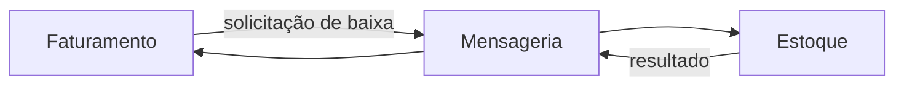
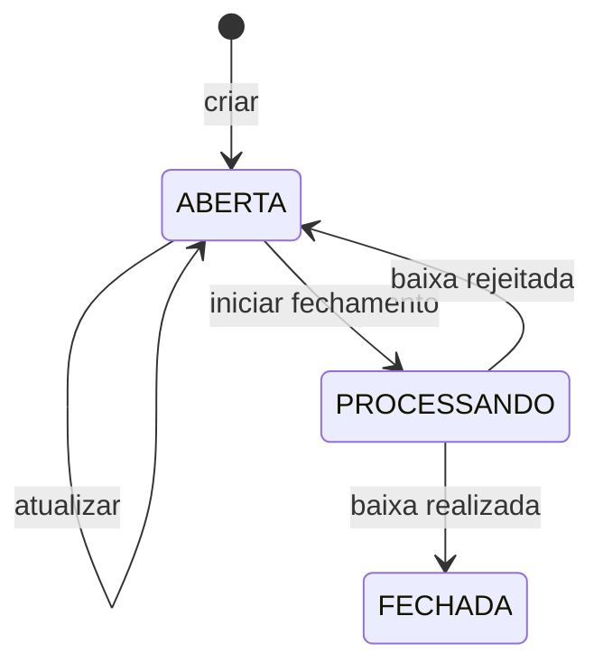

# Modelo de domínio

## Contextos delimitados



O Estoque decide se uma baixa é válida. O Faturamento decide o ciclo de vida da
nota. Nenhuma entidade é compartilhada entre os módulos.

## Produto

`Produto` é a raiz do agregado de Estoque.

```text
Produto
├── id
├── codigo
├── descricao
├── saldo
├── valor
├── ativo
├── dataCadastro
└── dataAtualizacao
```

### Invariantes

- ID válido;
- código e descrição não vazios;
- código normalizado e imutável;
- saldo não negativo;
- valor não negativo;
- produto novo ativo;
- baixa com quantidade positiva;
- baixa nunca deixa saldo negativo.

Campos são privados. Construtores seguem `NewNomeDaEntidade`; reconstituição de
models também passa pelas invariantes. Não existem setters genéricos.

### Comportamentos

- atualizar campos cadastrais permitidos;
- ativar e inativar;
- validar e aplicar alteração de saldo;
- produzir os dados necessários para movimentação.

## Movimentação de estoque

Registra toda variação de saldo:

```text
Movimentacao
├── id
├── produtoId
├── tipo: ENTRADA | SAIDA
├── quantidade
├── referencia
└── dataMovimentacao
```

A referência associa uma saída automática à nota fiscal. Atualizações manuais
também geram movimentação, garantindo auditoria do saldo.

## Baixa de múltiplos itens

A baixa é uma operação de aplicação apoiada pelo domínio e pelo repositório:

- o domínio valida produto, estado e quantidade;
- o use case orquestra a lista e o resultado;
- o repositório garante atomicidade e concorrência no PostgreSQL.

Todos os itens são processados ou nenhum é. Solicitação repetida é reconhecida
pelo `eventId` e não produz nova movimentação.

## Nota Fiscal

`NotaFiscal` é a raiz do agregado de Faturamento.

```text
NotaFiscal
├── id
├── numero
├── status
├── nomeCliente
├── enderecoCliente
├── itens[]
├── quantidadeTotal
├── valorTotal
├── motivoRejeicao
├── dataCadastro
├── dataAtualizacao
└── dataFechamento
```

### Invariantes

- número positivo e gerado por sequence;
- nome e endereço obrigatórios;
- pelo menos um item;
- status pertencente ao enum do domínio;
- totalizadores derivados dos itens;
- apenas nota aberta pode ser editada ou iniciar fechamento;
- apenas nota processando pode receber resultado.

Nome e endereço são normalizados em uppercase.

## Item da nota

```text
ItemNotaFiscal
├── id
├── produtoId
├── codigoProduto
├── descricaoProduto
├── quantidade
├── valorUnitario
└── valorTotal
```

Quantidade deve ser positiva e o produto precisa existir e estar ativo no
momento do snapshot. O valor total do item é calculado por quantidade vezes
valor unitário.

O `produtoId` é uma referência lógica, não uma foreign key entre schemas. Código,
descrição e valor são cópias históricas intencionais.

## Estados da nota



### ABERTA

Aceita edição de cliente, endereço e itens. Pode iniciar fechamento. Se veio de
uma rejeição, expõe o motivo recebido do Estoque.

### PROCESSANDO

Estado transitório. Bloqueia edição e nova solicitação. O motivo anterior é
limpo ao entrar nesse estado.

### FECHADA

Estado final após baixa confirmada, com data de fechamento.

## Rejeições de baixa

Motivos de negócio podem incluir:

- `ESTOQUE_INSUFICIENTE`;
- `PRODUTO_INATIVO`;
- produto inexistente ou item inválido conforme contrato do consumidor.

O Estoque publica a rejeição. O Faturamento reabre a nota e guarda o motivo para
consulta pelo cliente.

## Objetos técnicos fora do domínio

Algumas estruturas são necessárias, mas não são entidades de negócio:

- `OutboxEvent`: garante persistência da intenção de publicar;
- `MensagemProcessada`: garante idempotência;
- DTOs HTTP: representam contratos externos;
- models GORM: representam tabelas;
- mensagens RabbitMQ: representam contratos de integração.

Mantê-las fora das entidades evita que detalhes de transporte e persistência
contaminem as regras.

## Erros e HTTP

O domínio retorna erros próprios, como produto ou nota não encontrado, saldo
insuficiente, status inválido e quantidade inválida. Ele não conhece códigos
HTTP.

Na apresentação, `domainerror` traduz erros conhecidos para `400`, `404` ou
`409`. Falhas inesperadas viram `500` sem exposição de detalhes internos.

## Totalizadores

```text
quantidadeTotal = soma das quantidades
valorTotal      = soma dos valores totais dos itens
```

O cliente nunca define esses campos. Eles são recalculados ao criar ou atualizar
a nota, preservando consistência interna do agregado.

## Princípios aplicados

1. domínio independente de framework e banco;
2. estado privado e comportamento explícito;
3. invariantes verificadas na criação e reconstituição;
4. use case por operação;
5. transação para mudanças que precisam ser atômicas;
6. propriedade exclusiva dos dados por contexto;
7. contratos de integração não reutilizados como entidades;
8. consistência eventual representada no estado da nota.
