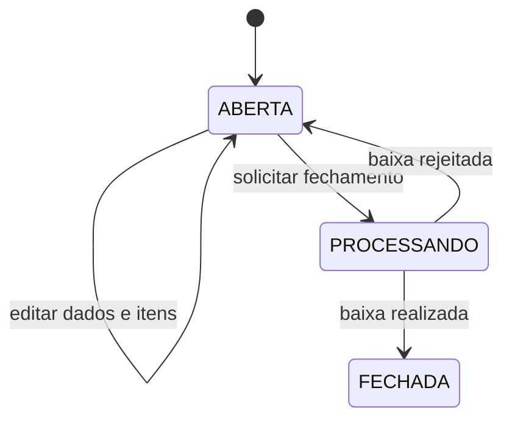

# Serviço de Faturamento

## Responsabilidade

O Faturamento é proprietário das notas fiscais, itens, numeração e ciclo de
fechamento. Ele não consulta tabelas do Estoque.

Suas responsabilidades são:

- criar e editar notas abertas;
- consultar produtos ativos pela API do Estoque;
- preservar um snapshot do produto em cada item;
- calcular quantidade e valor totais;
- gerar numeração sequencial;
- iniciar o fechamento com Transactional Outbox;
- processar resultados de baixa de maneira idempotente;
- fechar a nota ou reabri-la com o motivo da rejeição.

## Criação e snapshot

O body envia apenas o código do produto e a quantidade. O Faturamento consulta
o Estoque e copia para o item:

- ID do produto;
- código;
- descrição;
- valor unitário.

Esse snapshot evita que uma alteração futura no cadastro modifique o histórico
da nota. Apenas produtos ativos podem ser adicionados.

```json
{
  "nomeCliente": "Maria da Silva",
  "enderecoCliente": "Rua das Flores, 100 - Curitiba/PR",
  "itens": [
    {
      "codigoProduto": "SKU-001",
      "quantidade": 2
    }
  ]
}
```

Nome, endereço, código e descrição são normalizados. Quantidade total e valor
total são calculados pelo domínio, nunca aceitos do cliente.

## Estados



- `ABERTA`: pode ser editada e iniciar fechamento;
- `PROCESSANDO`: aguarda resposta do Estoque e não pode ser editada;
- `FECHADA`: estado final, com data de fechamento.

Na rejeição, o motivo é persistido. Ao iniciar uma nova tentativa de fechamento,
o motivo anterior é limpo.

## Fechamento e Outbox

Na mesma transação PostgreSQL, o repositório:

1. altera a nota de `ABERTA` para `PROCESSANDO`;
2. insere `estoque.baixa.solicitada` em `outbox_events`;
3. confirma as duas mudanças juntas.

Um worker busca eventos sem `published_at`, publica no RabbitMQ e só marca a
data de publicação após receber confirmação do broker. O detalhamento de falhas
e duplicidades está em [RESILIENCIA.md](RESILIENCIA.md).

## API HTTP

| Método | Rota | Finalidade |
|---|---|---|
| `POST` | `/notas-fiscais` | Criar nota aberta |
| `PUT` | `/notas-fiscais/{id}` | Substituir cabeçalho e itens da nota aberta |
| `GET` | `/notas-fiscais` | Listar com paginação e filtros |
| `GET` | `/notas-fiscais/{id}` | Buscar nota por UUID |
| `POST` | `/notas-fiscais/{id}/fechamento` | Iniciar processamento |
| `GET` | `/health` | Verificar API e banco |

### Paginação e filtros

```text
GET /notas-fiscais?pagina=1&tamanhoPagina=20&numero=100&status=ABERTA&nomeCliente=MARIA
```

As notas são ordenadas por prioridade operacional: `PROCESSANDO`, `ABERTA` e
`FECHADA`. Dentro do mesmo status, aparecem primeiro as notas cadastradas mais
recentemente; o número decrescente é usado como desempate.

### Criar pelo PowerShell

```powershell
$body = @{
    nomeCliente = "Maria da Silva"
    enderecoCliente = "Rua das Flores, 100 - Curitiba/PR"
    itens = @(
        @{ codigoProduto = "SKU-001"; quantidade = 2 }
    )
} | ConvertTo-Json -Depth 4

Invoke-RestMethod `
    -Method Post `
    -Uri "http://localhost:8082/notas-fiscais" `
    -ContentType "application/json" `
    -Body $body
```

### Criar pelo Bash, Zsh ou Git Bash

```bash
curl -X POST http://localhost:8082/notas-fiscais \
  -H 'Content-Type: application/json' \
  -d '{"nomeCliente":"Maria da Silva","enderecoCliente":"Rua das Flores, 100","itens":[{"codigoProduto":"SKU-001","quantidade":2}]}'
```

## Configuração obrigatória

```text
FATURAMENTO_HTTP_PORT
FATURAMENTO_CORS_ALLOWED_ORIGINS
FATURAMENTO_DATABASE_URL
FATURAMENTO_ESTOQUE_BASE_URL
FATURAMENTO_RABBITMQ_URL
FATURAMENTO_OUTBOX_INTERVAL
RABBITMQ_RECOVERY_MAX_RETRIES
RABBITMQ_RECOVERY_INTERVAL
RABBITMQ_MESSAGE_TIMEOUT
RABBITMQ_MESSAGE_MAX_RETRIES
RABBITMQ_MESSAGE_RETRY_DELAY
```

Não existem valores padrão no código.

## Execução local

O Estoque precisa estar acessível na URL configurada:

```console
cd services/faturamento
go mod download
go run ./cmd/migrate up
go run ./cmd/api
```

Swagger: <http://localhost:8082/swagger/index.html>.

## Migrations

```console
cd services/faturamento
go run ./cmd/migrate up
go run ./cmd/migrate version
go run ./cmd/migrate down
go run ./cmd/migrate force 7
```

O Faturamento usa sua própria tabela de controle de versão,
`faturamento_schema_migrations`. O schema evolui somente por SQL versionado;
`AutoMigrate` não é utilizado.

A migration `000008_seed_notas_abertas_realistas` cria notas abertas com
clientes, endereços e itens fictícios. Os itens mantêm o snapshot de código,
descrição e valor e usam os mesmos IDs dos produtos criados pelo seed do Estoque.

## Swagger

```console
cd services/faturamento
go run github.com/swaggo/swag/cmd/swag@v1.16.6 init -g cmd/api/main.go -o docs
```
